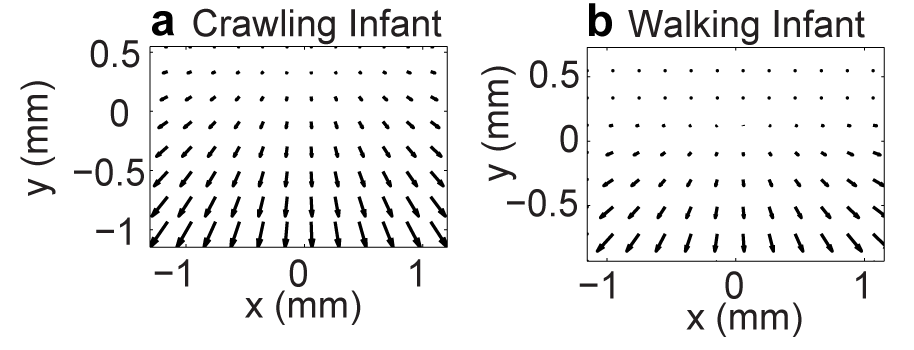
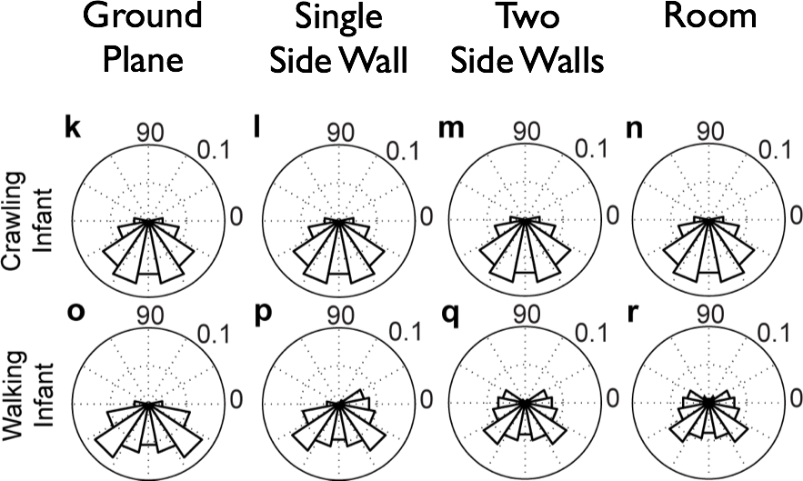

```{r setup, include=FALSE}
knitr::opts_chunk$set(comment=NA, fig.width=8, fig.height=4.5, echo=FALSE, error=FALSE, warning=FALSE, message=FALSE, include=FALSE)
```

## Changes in early optic flow experiences across development and culture {.flexbox .vcenter}

<div class="centered">
### **Swapnaa Jayaraman**, Indiana University
### **Rick O. Gilmore**, Penn State
### **Florian Raudies**, HP Research


Supported by NSF BCE-1147440, NSF BCS-1238599, NICHD U01-HD-076595
</div>

## Background

- What is optic flow?
- How does sensitivity to optic flow develop?
- How do infants' natural experiences with optic flow develop?
- Do the statistics of infants' natural experiences align with changes in sensitivity?

## What is optic flow?

<iframe width="560" height="315" src="https://www.youtube.com/embed/o27tIdYggY0" frameborder="0" allowfullscreen></iframe>

## What is Optic Flow? {.flexbox .vcenter}

<div class="centered">

</div>

## How Does Optic Flow Sensitivity Develop?
 
- Sensitivity at birth [[@jouen_optic_2000]](http://10.1016/S0163-6383(01)00044-3)
- Infants more sensitive to fast, translational flow [[@hou_spatio-temporal_2009]](http://doi.org/10.1016/j.visres.2009.08.007), [[@gilmore_development_2007]](http://doi.org/10.1017/S0952523807070769)
- Adults more sensitive to slow, radial flow

## Developmental Changes in Experiences of Optic Flow

- [[@raudies_understanding_2012]](http://doi.org/10.1109/DevLrn.2012.6400584)
    - Infants experience faster flow than mothers even when geometry, speed of locomotion equated
- [[@raudies_visual_2014]](http://doi.org/http://dx.doi.org/10.1162/NECO_a_00645)
    - Motion "prior" for infants faster than for mothers
    - Empirical motion priors not "slow" as predicted by theory

## Developmental/Cultural Factors

- **Posture**: Walking vs. Crawling
    - Distance to ground surface
    - Head pitch relative to ground
- **Geometry**: Typical distance to surfaces, objects; number of people, objects
- **Moving through space**: self vs. object motion

## Approach

- **Simulating** changes in optic flow due to changes in body size & posture, geometry
- **Measuring** flow experienced in natural contexts by head-mounted cameras

## Optic Flow Equation {.flexbox .vcenter .smaller}

<div class="centered">
$\begin{pmatrix}\dot{x} \\ \dot{y}\end{pmatrix}=\frac{1}{z}
\begin{pmatrix}-f & 0 & x\\ 0 & -f  & y \end{pmatrix}
\begin{pmatrix}{v_x{}}\\ {v_y{}} \\{v_z{}}\end{pmatrix}+
\frac{1}{f}
\begin{pmatrix}
xy & -(f^2+x^2) & fy\\ 
f^2+y^2 & -xy & -fy
\end{pmatrix}
\begin{pmatrix}
\omega_{x}\\ 
\omega_{y}\\ 
\omega_{z}
\end{pmatrix}$
</div>

## Parameters For Simulation

| Parameter | Crawling Infant | Walking Infant |
|-----------|-----------------|----------------|
| Eye height| 0.30 m          | 0.60 m         |
| Locomotor speed | 0.33 m/s  | 0.61 m/s       |
| Head tilt | 20 deg          | 9 deg          |

<div class="centered">
</br>


[[@kretch_crawling_2014]](http://dx.doi.org/10.1111/cdev.12206)
</div>

## Parameters for Simulation

| Geometric Feature        | Distance |
|--------------------------|----------|
| Side wall                | +/- 2 m  |
| Side wall height         | 2.5 m    |
| Distance of ground plane | 32 m     |
| Field of view width      | 60 deg   |
| Field of view height     | 45 deg   |

## Simulating Flow Fields {.flexbox .vcenter}

<div class="centered">


[[@gilmore_what_2015]](http://doi.org/10.1109/DEVLRN.2015.7345450)
</div>

## Flow Direction Distributions by Geometry & Posture

<div class="centered">


[[@gilmore_what_2015]](http://doi.org/10.1109/DEVLRN.2015.7345450)
</div>

## Simulated Flow Speeds (m/s)

| Type of Locomotion | Ground Plane | Room | Side Wall | Two Walls |
|--------------------|--------------|------|-----------|-----------|
| Crawling           | 14.41        | 14.42| 14.43     |14.62      |
| Walking            | 9.38         | 8.56 | 7.39      |9.18       |

<div class="centered">

[[@gilmore_what_2015]](http://doi.org/10.1109/DEVLRN.2015.7345450)
</div>

## **Measuring** Optic Flow in Natural Contexts

- First-person videos from head-mounted cameras
- Chennai, India & Bloomington, Indiana
- Data: <http://databrary.org/volume/81>
- n=32 infants, 16 each from India & U.S., 3-63 wks

## Workflow

- Extract optic flow from video, [(code repo)](https://github.com/opticflow/analysis)
- Human coders judge whether infant is moving or stationary.
- How do flow patterns and speeds vary by
    + Age
    + Geography/Culture
    + Moving/stationary status
    
---

<div class="centered">
<video width="750" height="450" controls>
  <source src="https://nyu.databrary.org/slot/11677/1737249,3012042/asset/41790/download?inline=true" type="video/mp4">
  Your browser does not support the video tag.
</video>

[[@203af95d-7211-4af0-9b68-d8feba107e7d]](http://dx.doi.org/10.17910/B7988V)
</div>

---

<div class="centered">
<video width="750" height="450" controls>
  <source src="https://nyu.databrary.org/slot/11680/0,24500/asset/41871/download?inline=true" type="video/mp4">
  Your browser does not support the video tag.
</video>

[[@203af95d-7211-4af0-9b68-d8feba107e7d]](http://dx.doi.org/10.17910/B7988V)
</div>

---

<div class="centered">
<video width="750" height="450" controls>
  <source src="https://nyu.databrary.org/slot/11680/25500,50000/asset/41873/download?inline=true" type="video/mp4">
  Your browser does not support the video tag.
</video>

[[@203af95d-7211-4af0-9b68-d8feba107e7d]](http://dx.doi.org/10.17910/B7988V)
</div>

---

<div class="centered">
<video width="750" height="450" controls>
  <source src="https://nyu.databrary.org/slot/11680/51000,75500/asset/41875/download?inline=true" type="video/mp4">
  Your browser does not support the video tag.
</video>

[[@203af95d-7211-4af0-9b68-d8feba107e7d]](http://dx.doi.org/10.17910/B7988V)
</div>

## Moving vs. Stationary Bouts {.flexbox .vcenter}

<div class="centered">
```{r prelim, include=TRUE}
source("analysis/moving.stationary.segments.df.R")
source("analysis/compute.p.moving.R")
df.s2 <- moving.stationary.segments.df()

library(ggplot2)
library(dplyr)
library(nlme)
library(tidyr)
library(knitr)

# Calculate summary stats to annotate plot
df.summary <- df.s2 %>%
  filter(secs <= 3*60) %>%
  mutate(mins = secs/60) %>%
  group_by(country, motion.status) %>%
  summarize(mins.med = median(mins),
            mins.mean = mean(mins))

# Convert minutes to seconds for readability
df.summary$label.med = paste0("median = ", round(df.summary$mins.med, 1), " m")
df.summary$label.mean = paste0("mean = ", round(df.summary$mins.mean*60, 1), " m")

p.ms.hist <- df.s2 %>%
  filter(secs <= 3*60) %>%
  mutate(mins = secs/60) %>%
  ggplot(mapping = aes(x=mins, fill=motion.status)) +
  geom_histogram() +
  facet_grid(motion.status ~ country) +
  ylab('Number of Segments') +
  xlab('Segment Duration (min)') +
  geom_text(data=df.summary, aes(x=rep(1.5,4), y=rep(1200,4), label=label.med), size=5) +
geom_text(data=df.summary, aes(x=rep(1.5,4), y=rep(800,4), label=label.mean), size=5) +
theme(panel.grid.major = element_blank(), panel.grid.minor = element_blank()) +
theme(strip.text = element_text(size=15), 
      axis.title = element_text(size=15),
      axis.text = element_text(size=15)) +
guides(fill=FALSE)

p.ms.hist
```
</div>

## *P*(moving) by Age, Location {.flexbox .vcenter}

<div class="centered">
```{r p.moving.byage, include=TRUE}
df.p.move.s2 <- compute.p.moving(df.s2)

p.moving.plt <- df.p.move.s2 %>%
  ggplot(mapping = aes(x=age.wks, y=p.motion)) +
  geom_point() + 
  geom_smooth() +
  facet_grid(facets = . ~ country) +
  ylab("Proportion of time in motion") +
  xlab("Age in weeks") +
  theme(strip.text = element_text(size=15), 
      axis.title = element_text(size=15),
      axis.text = element_text(size=15))
p.moving.plt
```
</div>

## Illustrative Speed Histograms - 6 weeks {.flexbox .vcenter}

<div class="centered">


</div>

## Illustrative Speed Histograms -- 34 weeks {.flexbox .vcenter}

<div class="centered">


</div>

## Illustrative Speed Histograms -- 58 weeks {.flexbox .vcenter}

<div class="centered">


</div>

## Empirical Pattern Distributions
- Correlation with 'canonical' flow patterns
    + radial
    + rotational
    + translational

## Pattern Correlation Results

<div class="centered">

</div>

## Conclusions: Simulation

- Posture influences optic flow speeds & patterns
    - Crawling: faster speeds, more translational flow
    - Proximity to ground and pitch of head
    - Geometry matters relatively little
 
## Conclusions: Empirical Data

- Time stationary >> time in motion
- Time in motion increases, faster in U.S.
- Fast speeds, broad speed distributions
- Linear flow >> radial or rotational flow

## Stack

- Databrary, <https://nyu.databrary.org/volume/81>
- Datayvu, <http://datavyu.org>
- Matlab-based optic flow routines, <http://github.com/opticflow>
- RStudio, <https://www.rstudio.com/>
- GitHub, <http://github.com/gilmore-lab/jayaraman-gilmore-raudies-ICIS-2016/>

## References {.smaller}